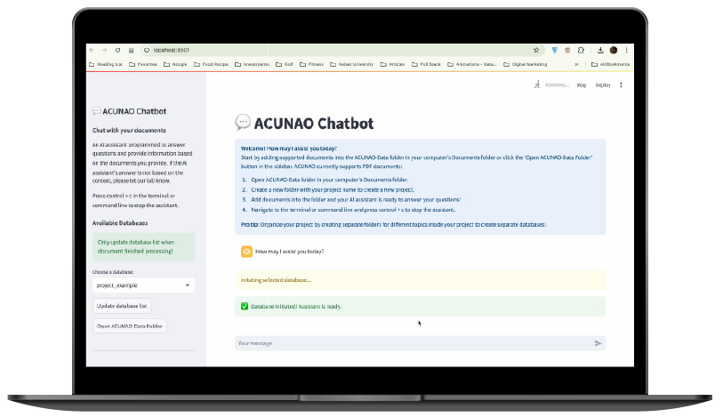

# ACUNAO-AI

> [**HERE**](https://github.com/luquelab/ACUNAO-AI) you can check the GitHub repository of this project.

## What is ACUNAO-AI?
An AI assistant as a domain expert of the lab’s documents that has the ability to answer users’ queries accurately. It assists users with organizing their projects and acts as a 'second brain'.

## Key Features

- 🧠 **Domain Expertise**  
  Trained specifically on lab documents to answer technical and interdisciplinary research questions accurately.

- 📚 **Knowledge Organization**  
  Helps manage, retrieve, and organize growing collections of complex, confidential research documents.

- 🛡️ **Confidential and Secure**  
  Built with privacy in mind to handle sensitive internal documents without risking data leaks.

- 🔬 **Tailored for Research Labs**  
  Designed to meet the unique needs of interdisciplinary research teams, not just the general public.

  <a href="/ACUNAO-AI/installation" style="font-size: 1.2rem; font-weight: bold; background-color: #007acc; color: white; padding: 10px 20px; border-radius: 5px; text-decoration: none;">Learn More →</a>

